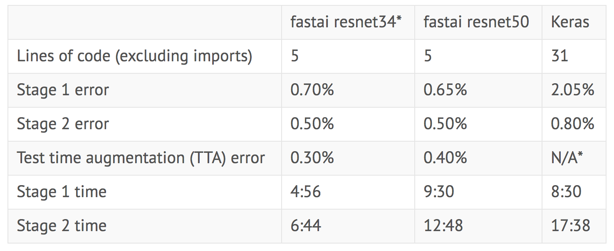

# Border Collies vs. Australian Shepherds Image Classification

Hello, and welcome to this image classification notebook, where I will demonstrate how to do image classification using deep learning/neural networks on a custom dataset that I collected. Using about 500 collected images of two similar looking dog breeds will yield 90+% accuracy in a matter of minutes.

### The Problem

After the death of my family's beloved 15-year old Border Collie, Archie, my mother recently looked into rescuing another. After contacting a group in the midwest who believed they were taking care of a Border Collie, my mother was shocked to find that it was actually an Australian Shepherd.

These two herding dog breeds look similar, and it can be hard to tell the difference!

### Fast.ai

I will be using the fast.ai wrapper for the PyTorch library to in this project. In the past, I may have found myself using Tensorflow (or to quickly iterate, the Keras wrapper), but recently I have become enamored with PyTorch's flexible dynamic graphs and modern architecture. Fast.ai's courses has been an invaluable resource as an introduction to PyTorch and deep learning, but their ready-made implementation modern best practices makes the library essential.

Here's a [quick comparison](https://www.fast.ai/2018/10/02/fastai-ai/) of fast.ai vs. Keras on Kaggle’s Dogs vs Cats competition.

This notebook will run on Fast.ai v1.0